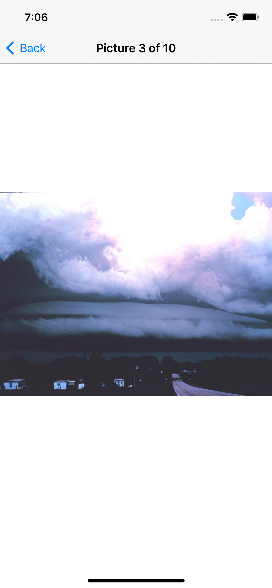

# Project 1 with Swift

## Description
This application is an exercise for learning how to connect different view controllers, list files from the app's directory, and reuse cells with the dequeueReusableCell function.

    
    

## Information behind the app
This application was created following the tutorial of [Hacking with swift](https://www.hackingwithswift.com/100).

Technologies used to build this app are XCode and Swift. 
Framework: Cocoa Touch.